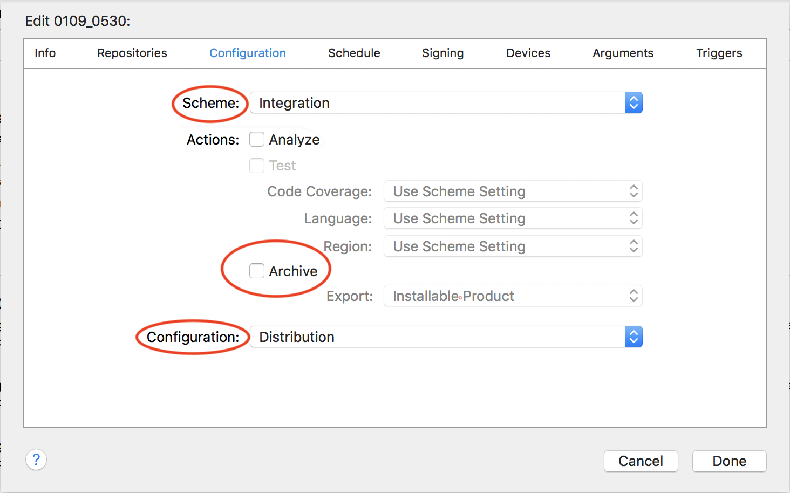

说到自动化打包, 相信大家在日常开发中都有所接触, 尤其是在多分支并行开发的情况下, 自动化打包显得尤为重要, 很多时候, 我们打包一般是打及成分支的包, 开发却在开发分支上, 如果采取手动打包, 我们需要反复切分支, 不仅影响工作效率, 而且会打断我们的开发思维, 而却在工程较大的情况下, xcode每次indexing需要的时间就很久。

即使对于很多单分支开发的小项目来说, 自动化打包的优势也是不言而喻的, 因为在手动打包的同时, 基本可以说是什么事都做不了的, 你需要一步步等待archive, export这些机械化的步骤。而有了自动化打包, 你只需要点击一个按钮, 便可以继续自己的开发。所以, 自动化打包势在必行。

本文主要记录了我在公司自动化打包布置中的一些探索, 及各平台的优缺点和配置过程踩过的坑。

谈到iOS的持续集成, 我们首先想到的一定会是jenkins, 这里我先介绍下我司采用的Mac OS Server(以下简称Server)这个平台的一些优缺点。

## Server相比于jenkins, 我总结优点有三: 

1. 相比于jenkins的各种繁琐配置, Server配置简单, 全程基本下一步操作即可
2. 直接使用xcode就可开始构建项目, 而不需要登录网页
3. 集成度相当高, 没有特别的需求, 基本可以不写脚本, 只需要配置一个plist文件即可以打包 
 
这里不做过多的配置介绍, 虽然Server没有jenkins热门, 但网上的文章也比比皆是, 而且如上优点1中所说, Server配置真的很简单, 在证书、描述文件齐全的情况下, 基本就是一直点下一步操作。

下面我介绍使用过程中需要注意的一些方面: 

如上图所示, 如果对打包没有特别需求, 勾选Archive, 选择对应Scheme、Configuration, 指定一个plist文件, 后面的Triggers不需要写任何代码, 便可以打出对应的包。

